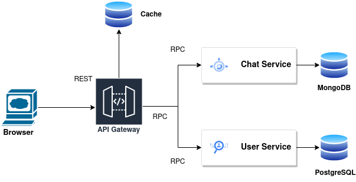

# PAD_LAB1:  Distributed Chat System

## 1. Access Application Suitability:

The development of a distributed web chat system using microservices is relevant and necessary for several reasons:
-   **Scalability**: As the user base grows, a monolithic architecture becomes cumbersome to maintain and scale. Microservices allow for scaling individual components independently, ensuring better performance under varying workloads.
-   **Flexibility**: Microservices enable the development team to choose the most suitable technology stack for each service, promoting flexibility in development and optimization.
-   **Reliability**: Isolating chat components into microservices enhances system reliability. Failures in one service do not necessarily affect the entire system, providing fault tolerance.
-   **Ease of Maintenance**: Microservices allow for easier maintenance and updates. Changes to one microservice do not necessitate modifying the entire system.

**Real-world Example**: Consider the architecture of popular messaging platforms like WhatsApp, Slack, or Facebook Messenger. These platforms employ microservices to handle various functionalities like chat, user management, and multimedia sharing.

## 2. Define Service Boundaries:

### Services and Responsibilities:
-   **API Gateway**: Responsible for defining the API for the platform, forwarding requests to specific microservices, validating requests, ensuring access control and keeping the latest information in the cache.
-   **Chat Service**: Manages different chats and their functionalities.
-   **User Service**: Handles user managing and related operations.
-   **Load Balancer**: Handles the network flow and increases/decreases the number of services to accomdate the flow
.


## 3. Choose Technology Stack and Communication Patterns

-   **API Gateway**: Node.js for API server, Express.js for routing.
-   **Chat Services**: Python for chat logic
-   **User Service**: Python with Flask for user authentication.
-   **Communication Patterns**: REST

## 4. Design Data Management:

-   Each microservice will have its dedicated database for optimal data management.
-   Use caching for frequently accessed data to improve performance.

### Communication between the components:

1.  **User Sign-up and Authentication**:
    -   When a user signs up or logs in, the User Service handles user authentication and generates an authentication token.
    -   The User Service also manages user profiles, including user IDs.
2.  **Creating a Chat**:
    -   When a user creates a new chat group, they specify the chat name and invite other users (participants) to the chat.
    -   The API Gateway receives the chat creation request and forwards it to the appropriate Chat Service.
3.  **Communication between User Service and Chat Services**:
    -   The User Service maintains a record of users' chat memberships. This record includes the user ID and the list of chat IDs they are part of.
    -   Chat Services are responsible for handling chat-related functionality.
    -   When a user is added to a chat or removed from a chat, the API Gateway sends a request to the User Service for user verification and permission.
    -   The User Service verifies the user's authentication token to ensure the user has the necessary permissions to be added or removed from the chat.
    -   Once verified, the User Service informs the appropriate Chat Service about the user's addition or removal from the chat.
4.  **Chat Services Manage Chat Participants**:
    -   Chat Services keep track of chat participants in their local databases.
    -   When a user is added to a chat, the Chat Service responsible for that chat updates its participant list.
    -   Similarly, when a user is removed from a chat, the Chat Service updates its participant list accordingly.

Here's a simplified example of how this communication might occur:
1.  User A creates a new chat and invites User B.
2.  The API Gateway forwards the chat creation request to the Chat Service.
3.  The Chat Service creates the chat and informs the User Service to add both User A and User B to the chat.
4.  The User Service verifies their identities and adds them to the chat.
5.  The Chat Service updates its list of participants and sends a real-time event to User A and User B to inform them about the new chat.

In this way, User Service and Chat Services work together to manage user authentication, permissions, and chat memberships, ensuring that users can be assigned to chats securely and efficiently in a distributed web chat system.

### Endpoints and Data Formats

### User Management

#### 1. User Sign-up

- **Endpoint**: `/api/user`
- **Method**: `POST`
- **Request Body**:
```json
{
  "username": "example_user",
  "email": "example@example.com"
}
```
- **Response**:
```json
{
  "message": "User registered successfully",
  "user": {
    "id": "unique_user_id",
    "username": "example_user",
    "email": "example@example.com"
  }
}
```

#### 2. User Log-in

- **Endpoint**: `/api/user
- **Method**: `POST`
- **Request Body**:
```json
{
  "username": "example_user",
  "password": "password123"
}
```
- **Response**:
```json
{
  "message": "Login successful",
  "user": {
    "id": "unique_user_id",
    "username": "example_user",
    "email": "example@example.com",
  }
}
```

### Chat Management

#### 3. Create a Chat

- **Endpoint**: `/api/chat`
- **Method**: `POST`
- **Request Body**:
```json
{
  "participants": ["user_id1", "user_id2"],
  "chatName": "Chat Group"
}
```
- **Response**:
```json
{
  "message": "Chat created successfully",
  "chat": {
    "id": "unique_chat_id",
    "participants": ["user_id1", "user_id2"],
    "chatName": "Chat Group"
  }
}
```

#### 4. Edit Chat Details

- **Endpoint**: `/api/chat/:chatId`
- **Method**: `PATCH`
- **Request Body**:
```json
{
  "chatName": "New Chat Name"
}
```
- **Response**:
```json
{
  "message": "Chat details updated successfully"
}
```

#### 5. Delete a Chat

- **Endpoint**: `/api/chat/:chatId`
- **Method**: `DELETE`
- **Response**:
```json
{
  "message": "Chat deleted successfully"
}
```

### Messaging

#### 6. Write a Message to a Chat

- **Endpoint**: `/api/chat/:chatId/message`
- **Method**: `POST`
- **Request Body**:
```json
{
  "message": "Hello, this is a message."
}
```
- **Response**:
```json
{
  "message": "Message sent successfully",
  "messageInfo": {
    "messageId": "unique_message_id",
    "message": "Hello, this is a message."
  }
}
```

### Data Storage

For data storage will be used PostgreSQL.


### 6. Run the project

To be able to run the project firstly pull the docker images by entering in the terminal:
```text
docker pull umadmary/pad-1:api-gateway
docker pull umadmary/pad-1:user-service
docker pull umadmary/pad-1:chat-service
```

Download the docker-compose.yml file together wit .db files and put them in the directory you are currently in.

Then use:
```text
docker compose up
```

To run the app using the files from github, build the docker-compose file using the following command:
```text
docker-compose up --build
```
To make the requests please consult the posman collection from this repository.

### 7. Future plans

In the plan is to implement the following:
1. Circuit Breaker
2. Service High Availability
3. ELK stack or Prometeus + Grafana for logging
4. 2 Phase Commits
5. Consistent Hashing for Cache
6. Cache High Availability